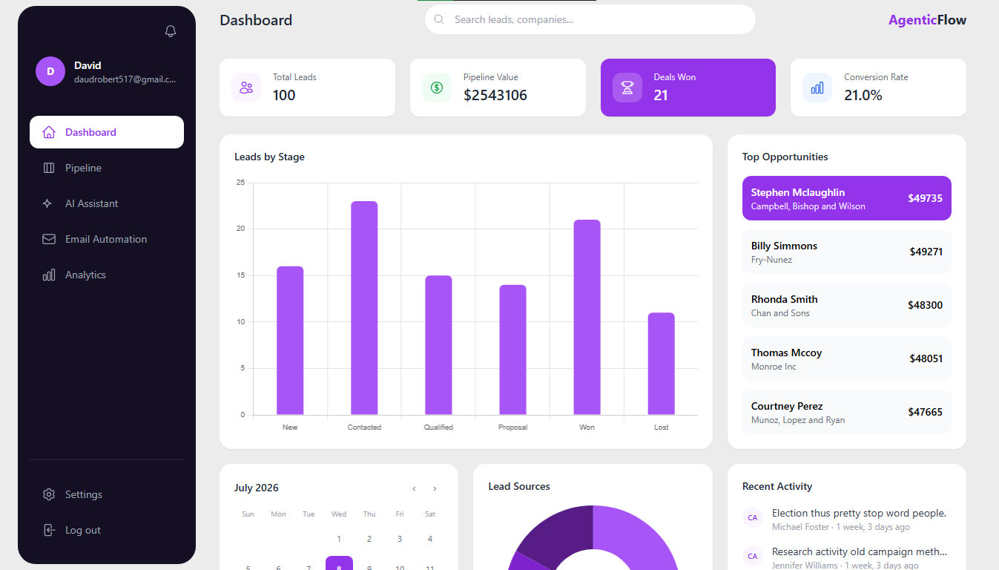
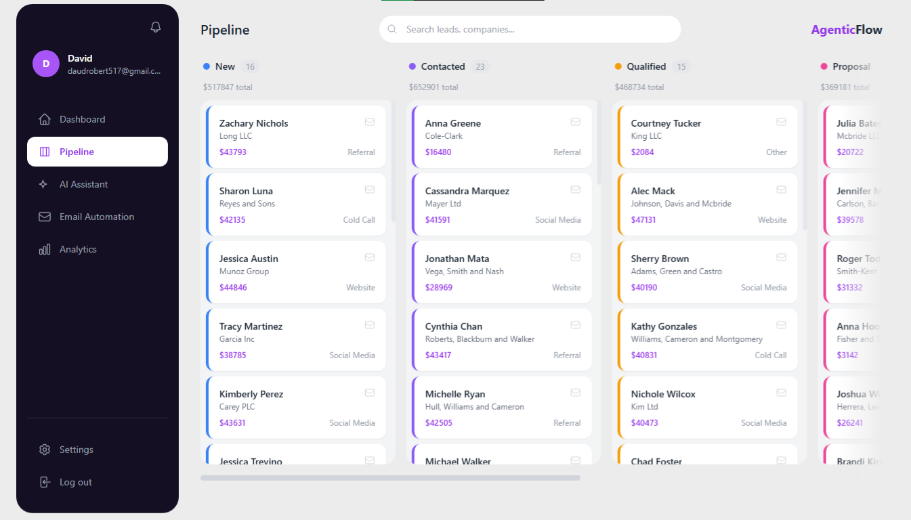
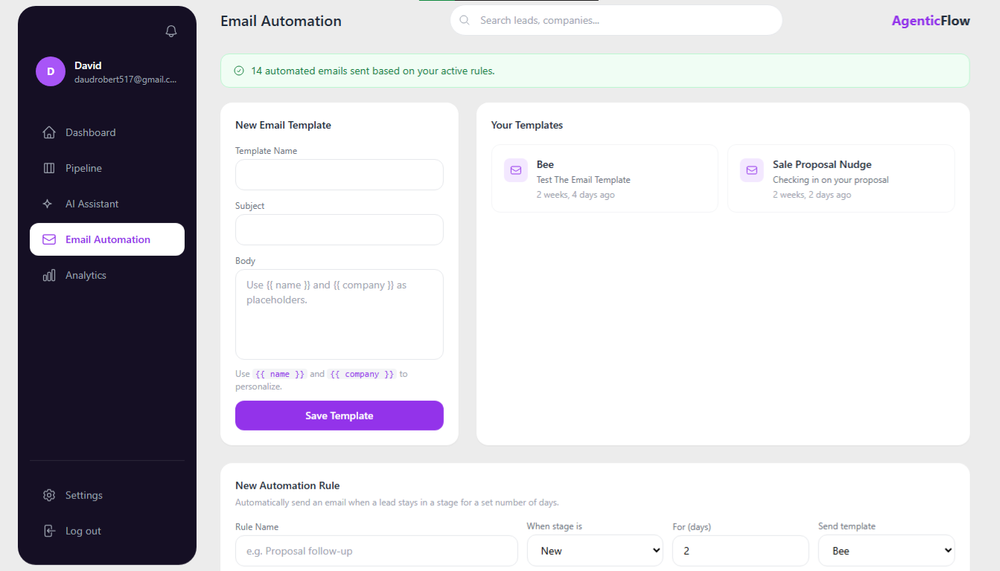
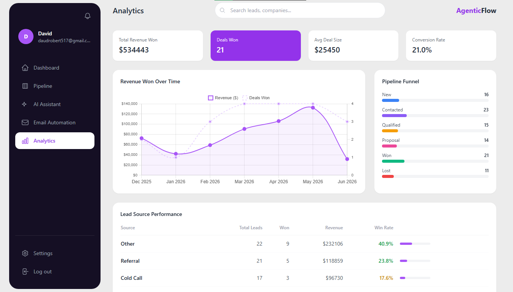
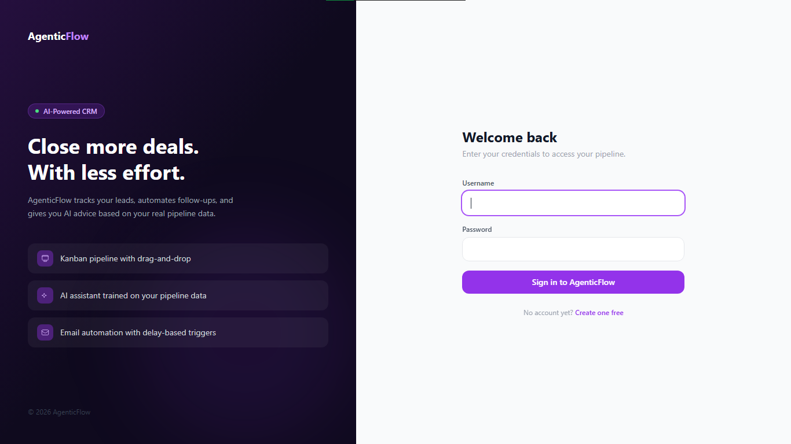

# AgenticFlow CRM

An AI-powered Sales Pipeline CRM built with Django. Manage leads, automate emails, and get real-time sales advice from an AI assistant trained on your actual pipeline data.



---

## Features

### Lead Pipeline (Kanban Board)
- Drag-and-drop lead cards between six pipeline stages: New, Contacted, Qualified, Proposal, Won, Lost
- Stage changes saved instantly to the database via AJAX
- Color-coded cards and stage indicators for instant visual context
- Per-column lead count and total pipeline value displayed

### AI Sales Assistant
- Chat interface powered by Groq LLaMA 3.1
- AI has access to your real pipeline data: total leads, stage breakdown, top opportunities, conversion rate
- Drafts follow-up emails, suggests next steps, and prioritizes leads based on actual data
- Conversation history maintained within each session
- Quick prompt cards for common sales tasks

### Email Automation
- Create reusable email templates with `{{ name }}` and `{{ company }}` placeholders
- Manual send from any lead card on the pipeline board
- Automation rules: send a template automatically when a lead stays in a stage for X days
- Full email log with sent/failed status for every email
- Toggle rules on and off without deleting them

### Analytics
- Revenue trend line chart across the last 6 months
- Pipeline funnel showing lead distribution across all stages
- Lead source performance table with win rates color-coded green, yellow, and red
- Summary cards: total revenue won, deals won, average deal size, conversion rate

### Dashboard
- Summary cards with icons: total leads, pipeline value, deals won, conversion rate
- Bar chart of leads by pipeline stage
- Monthly calendar showing lead creation activity with purple dot indicators
- Lead sources donut chart
- Recent activity feed
- Top opportunities list with highest-value lead highlighted

### Authentication
- Custom user model with company name and phone number fields
- Signup, login, and logout with session management
- Owner-scoped data: each user only sees their own leads, templates, and rules
- Split-panel auth pages with feature highlights

---

## Tech Stack

| Layer | Technology |
|---|---|
| Backend | Django 5.x |
| Database | SQLite (development) |
| Frontend | Tailwind CSS (CDN), vanilla JavaScript |
| AI | Groq API (LLaMA 3.1 8B Instant) |
| Charts | Chart.js |
| Drag and Drop | SortableJS |
| Fake Data | Faker |

---

## Project Structure

## Project Structure

```
agenticflow-crm/
├── accounts/
│   ├── views.py          # Dashboard, analytics, AI assistant, auth views
│   ├── models.py         # Custom user model
│   ├── forms.py          # Signup and login forms
│   └── urls.py           # Account URL routes
├── leads/
│   ├── views.py          # Pipeline, email automation views
│   ├── models.py         # Lead, PipelineStage, Activity, EmailTemplate, AutomationRule
│   ├── urls.py           # Lead URL routes
│   └── management/
│       └── commands/
│           └── seed_leads.py   # Fake data generator
├── templates/
│   ├── accounts/         # Dashboard, analytics, AI assistant, auth pages
│   ├── leads/            # Pipeline, email automation pages
│   └── partials/         # Shared sidebar and topbar
├── crm_project/
│   ├── settings.py       # Django project settings
│   └── urls.py           # Root URL configuration
├── manage.py
├── requirements.txt
└── .env                  # API keys (not committed)
```

## Local Setup

### Prerequisites
- Python 3.10 or higher
- A free Groq API key from [console.groq.com](https://console.groq.com)

### Installation

**1. Clone the repository**
```bash
git clone https://github.com/daudrobert517-sudo/Agentic_Flow_CRM.git
cd Agentic_Flow_CRM
```

**2. Create and activate a virtual environment**
```bash
python -m venv venv

# Windows
.\venv\Scripts\Activate.ps1

# Mac/Linux
source venv/bin/activate
```

**3. Install dependencies**
```bash
pip install -r requirements.txt
```

**4. Create a .env file in the project root**

GROQ_API_KEY=your_groq_api_key_here

**5. Run migrations**
```bash
python manage.py migrate
```

**6. Create a superuser**
```bash
python manage.py createsuperuser
```

**7. Seed the database with realistic fake data**
```bash
python manage.py seed_leads --count 100
```

**8. Start the development server**
```bash
python manage.py runserver
```

Visit `http://127.0.0.1:8000/accounts/signup/` to create your account and explore the app.

---

## Key Design Decisions

**Owner-scoped security:** Every database query filters by `owner=request.user`, so users can only access their own data. This applies to AJAX endpoints too, including the drag-and-drop stage update and email send endpoints.

**No external task queue:** Email automation rules are checked on page visit rather than running a background scheduler. This keeps the stack simple for a portfolio project while demonstrating the full automation logic: delay calculation, template rendering, duplicate prevention, and logging.

**Groq over OpenAI:** The AI assistant uses Groq's free tier instead of a paid API, making this project fully reproducible without any cost.

**json_script for safe data passing:** All Python data passed into JavaScript uses Django's `json_script` filter rather than inline template tags, avoiding both XSS vulnerabilities and VS Code false-positive warnings.

---

## Screenshots

### Dashboard


### Pipeline Board


### AI Assistant


### Email Automation


### Analytics


### Login


---

## License

MIT License. Feel free to use this project as a reference or starting point for your own CRM.

---

Built by [David Robert](https://github.com/daudrobert517-sudo)